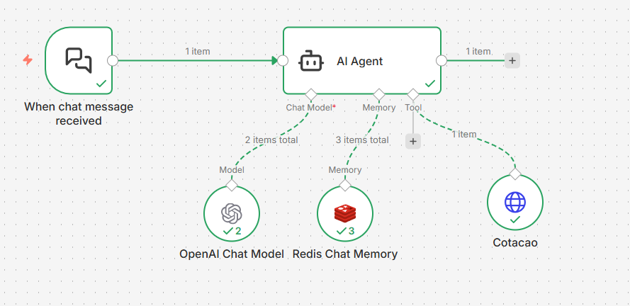

# 🤖 AI Financial Analyst Agent  


---

## 🧠 Visão Geral

Este projeto implementa um **Agente de Inteligência Artificial especializado em finanças e câmbio**, capaz de compreender linguagem natural, manter contexto de conversa e **consultar dados financeiros em tempo real** por meio de ferramentas externas.

Diferente de chatbots tradicionais baseados apenas em regras ou LLMs estáticos, este agente utiliza **Tool Calling** para decidir, de forma autônoma, **quando e como consultar APIs externas**, retornando respostas atualizadas e contextualizadas.

Além disso, o agente possui **memória persistente via Redis**, permitindo diálogos contínuos e naturais ao longo de múltiplas interações.

---

## 🎯 Casos de Uso

- Assistente financeiro conversacional
- Consulta de câmbio em tempo real
- Chatbots inteligentes para bancos e fintechs
- APIs de IA com memória de contexto
- Prova de conceito (PoC) de agentes autônomos
- Integrações com ERPs, CRMs e dashboards financeiros

---



## 🏗️ Arquitetura do Agente

O workflow foi construído utilizando a arquitetura de **Chains do LangChain**, orquestradas dentro do **n8n**.

### 🔹 Componentes Principais

#### 💬 Interface de Chat
- **Chat Trigger (Webhook)**
- Recebe mensagens do usuário via HTTP

#### 🧠 Cérebro (LLM)
- **AI Agent Node**
- Modelo: **GPT-4o-mini**
- Responsável por:
  - Interpretação da intenção do usuário
  - Decisão de uso de ferramentas (Tool Calling)
  - Geração da resposta final

#### 🧾 Memória Persistente
- **Redis**
- Armazena o histórico da conversa
- Permite referências contextuais, como:
  > “E quanto isso vale em reais?”

#### 🛠️ Ferramenta Personalizada (Tool)
- **Tool: Cotacao**
- Função exposta ao LLM
- Quando o usuário pergunta, por exemplo:
  > “Quanto está o dólar hoje?”
- O agente:
  1. Identifica a intenção
  2. Extrai a moeda (USD)
  3. Invoca a ferramenta
  4. Consulta a API de economia
  5. Retorna o valor formatado ao usuário

---

## 🛠️ Tecnologias Utilizadas

- **Orquestração:** n8n (Workflow Automation)
- **LLM:** OpenAI GPT-4o-mini  
  - Custo-eficiente
  - Suporte nativo a Tool Calling
- **Memória:** Redis  
  - Persistência de contexto conversacional
- **Integração de Dados:** HTTP Request Tool
- **API Financeira:** AwesomeAPI

---

## 🚀 Como Executar

### ✅ Pré-requisitos

- Instância do **n8n** (Cloud ou Self-hosted)
- Instância do **Redis** (Local via Docker ou Cloud)
- **API Key da OpenAI**
- **Token da AwesomeAPI**

---

### ⚙️ Configuração

#### 1️⃣ Importar o Workflow
- Importe o arquivo `.json` deste repositório no n8n

#### 2️⃣ Configurar Credenciais
- **OpenAI Account**
  - Insira sua API Key da OpenAI
- **Redis Account**
  - Configure a URL de conexão com o Redis

#### 3️⃣ Segurança da Tool de Cotação
- Abra o nó da ferramenta **Cotacao**
- Em **Query Parameters**
- Insira seu token real da **AwesomeAPI**

---

## 💡 Destaques da Implementação

### 🧠 Uso de Expressões de IA (`$fromAI`)
A ferramenta utiliza expressões dinâmicas para garantir que o LLM envie os parâmetros corretamente:

```js
{{ $fromAI('moeda', 'Codigo da moeda que o usuario informar no formato BRL, USD, EUR') }}
